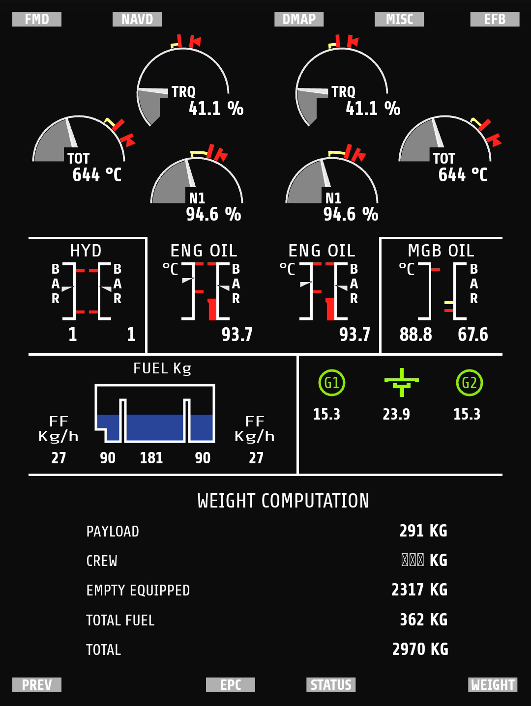
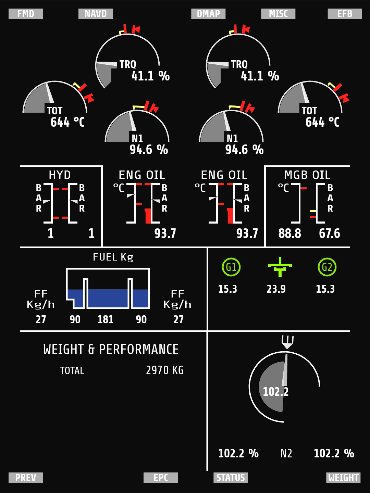

# XPlaneH145ExternalPanel
Early version of an external MFD for the H145 in X-Plane

[Video preview 1](https://www.youtube.com/watch?v=_tj4wiKTeF4)

##Help (before reading below) 

I need help from anyone who as any resource on the Helionix system so I can get a best replica of it. If you know
anything more or you have some material, send a private message via [mail](mailto:danielezotta@gmail.com).

## Basic info
For now the application uses the XPlaneConnect plugin from NASA. You need to have that installed.
The communication between XPlane and the monitor is coded in Python 3.8, the monitor in HTML/CSS/Javascript.

### Support

The panel to run needs (currently) a Python 3.8 installation with all the needed modules. Moreover needs a client with
a browser that supports WebSockets (probably every browser since 2013). So if you want to use this panel in a different 
device, make sure is in the same network as your PC.

### TODO

* get some info about the data displayed
* MGB oil indicators correction
* bottom engine screen sub menus
* other screens than engine

## License

Copyright (c) 2020 Daniele Zotta

Permission is hereby granted, free of charge, to any person obtaining a copy
of this software and associated documentation files (the "Software"), to deal
in the Software without restriction, including without limitation the rights
to use, copy, modify, merge, publish, distribute, sublicense, and/or sell
copies of the Software, and to permit persons to whom the Software is
furnished to do so, subject to the following conditions:

The above copyright notice and this permission notice shall be included in all
copies or substantial portions of the Software.

THE SOFTWARE IS PROVIDED "AS IS", WITHOUT WARRANTY OF ANY KIND, EXPRESS OR
IMPLIED, INCLUDING BUT NOT LIMITED TO THE WARRANTIES OF MERCHANTABILITY,
FITNESS FOR A PARTICULAR PURPOSE AND NONINFRINGEMENT. IN NO EVENT SHALL THE
AUTHORS OR COPYRIGHT HOLDERS BE LIABLE FOR ANY CLAIM, DAMAGES OR OTHER
LIABILITY, WHETHER IN AN ACTION OF CONTRACT, TORT OR OTHERWISE, ARISING FROM,
OUT OF OR IN CONNECTION WITH THE SOFTWARE OR THE USE OR OTHER DEALINGS IN THE
SOFTWARE.
